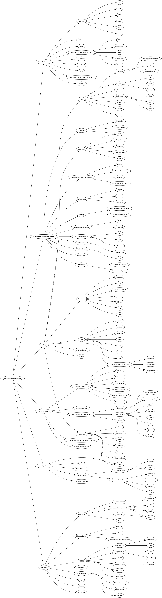

# Golang Software Engineer Roadmap

At the beginning, this roadmap was written in [DOT language](roadmap.deprecated.dot) and converted by [Graphviz](https://graphviz.gitlab.io/download/).
But later it has been rewritten in [GraphML](roadmap.xml).

There is also [circle PNG version](data/roadmap.circle.png) and [markdown version](data/roadmap.md).

Improvements are welcomed.

## Links
- [Go Developer Roadmap](https://github.com/Alikhll/golang-developer-roadmap)
- [Programmer Competency Matrix](http://sijinjoseph.com/programmer-competency-matrix/)
- [Roadmaps for Developers: Backend Developer](https://roadmap.sh/backend)
- [Roadmap to becoming a Software Engineer 2018 Edition with Industry Insights: Back-end Roadmap](https://github.com/fauzanbaig/software-engineer-roadmap#-back-end-roadmap)